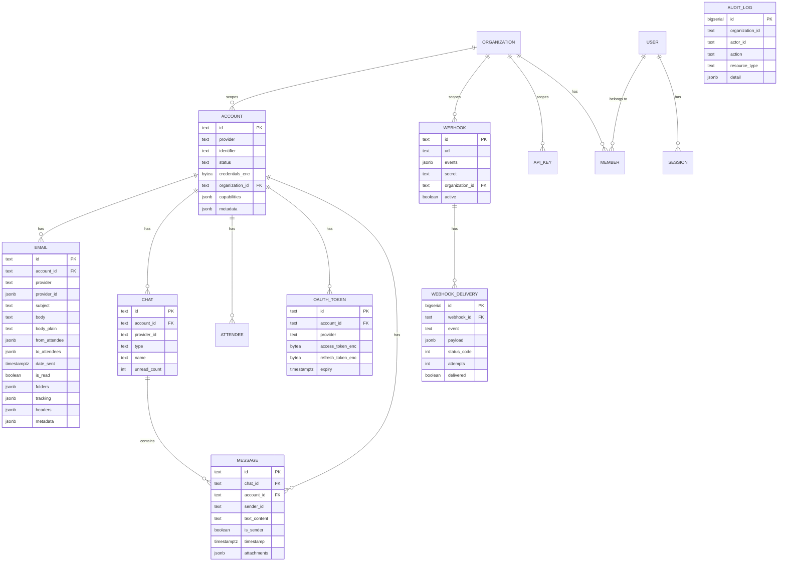

# Phase 3: Data Architecture

> **Status:** Draft
> **Date:** 2026-03-25
> **Source:** 11 migration files, 8 model files, store layer audit

---

## Overview

Ondapile uses **PostgreSQL as the sole data store** — no Redis, no message queue, no external cache. Everything lives in one database: entities, auth sessions, webhook delivery queue, email tracking, OAuth tokens, and audit logs.

The schema has 11 tables across 11 sequential migrations, plus Better Auth managed tables (user, session, account, verification, organization, member, api_key, subscription).

---

## Entity Definitions

### Entity: Account
- **Owned by:** Store layer (`internal/store/accounts.go`)
- **Created by:** SaaS Publisher (via API), End User (via hosted auth callback)
- **Read by:** Developer (API), Dashboard (frontend), Adapters (reconnect)
- **Core fields:**
  - `id` — TEXT, PK, prefix `acc_`
  - `provider` — TEXT (IMAP, GMAIL, OUTLOOK, WHATSAPP, LINKEDIN, INSTAGRAM, TELEGRAM, GCAL)
  - `identifier` — TEXT (email address, phone number, profile ID)
  - `status` — TEXT (OPERATIONAL, AUTH_REQUIRED, CHECKPOINT, INTERRUPTED, PAUSED, CONNECTING)
  - `credentials_enc` — BYTEA (AES-256-GCM encrypted JSON)
  - `organization_id` — TEXT (multi-tenant scoping, added migration 010)
  - `capabilities` — JSONB array (["email"], ["email","calendar"], ["messaging"])
- **Relationships:** Has many Emails, Chats, Messages, OAuth Tokens, Attendees
- **Lifecycle:** CONNECTING → OPERATIONAL → [INTERRUPTED/AUTH_REQUIRED] → OPERATIONAL (reconnect) → deleted
- **Indexes:** provider, status, organization_id

### Entity: Email
- **Owned by:** Email subsystem (`internal/email/store.go`)
- **Created by:** IMAP sync (polling), Gmail/Outlook API sync, API send
- **Read by:** Developer (API), Tracking subsystem (for open/click updates)
- **Core fields:**
  - `id` — TEXT, PK, prefix `eml_`
  - `account_id` — TEXT, FK → accounts
  - `provider` — TEXT
  - `provider_id` — JSONB ({message_id, thread_id})
  - `subject`, `body` (HTML), `body_plain` — TEXT
  - `from_attendee`, `to_attendees`, `cc_attendees`, `bcc_attendees` — JSONB
  - `date_sent` — TIMESTAMPTZ
  - `folders` — JSONB array (["INBOX"])
  - `is_read` — BOOLEAN
  - `tracking` — JSONB ({opens, first_opened_at, clicks, links_clicked[]})
  - `headers` — JSONB array
  - `metadata` — JSONB (provider-specific data like IMAP UID)
- **Relationships:** Belongs to Account
- **Lifecycle:** Created (sync/send) → Read/Updated (mark read, move folder, track) → Deleted
- **Indexes:** account_id, date_sent DESC, (account_id, role), (account_id, is_read) WHERE is_read=FALSE

### Entity: Chat
- **Owned by:** Store layer (`internal/store/chats.go`)
- **Created by:** Provider sync, API (start new chat)
- **Read by:** Developer (API)
- **Core fields:**
  - `id` — TEXT, PK, prefix `chat_`
  - `account_id` — TEXT, FK → accounts
  - `provider_id` — TEXT (provider's native chat/conversation ID)
  - `type` — TEXT (ONE_TO_ONE, GROUP)
  - `name` — TEXT (group name or contact name)
  - `unread_count` — INTEGER
  - `last_message_at` — TIMESTAMPTZ
  - `last_message_preview` — TEXT
- **Relationships:** Belongs to Account, Has many Messages
- **Lifecycle:** Created → Active → Archived → Deleted
- **Note:** Not in v1 scope (messaging providers are post-v1)

### Entity: Message
- **Owned by:** Store layer (`internal/store/messages.go`)
- **Created by:** Provider sync, API (send message)
- **Read by:** Developer (API)
- **Core fields:**
  - `id` — TEXT, PK, prefix `msg_`
  - `chat_id` — TEXT, FK → chats
  - `account_id` — TEXT, FK → accounts
  - `sender_id` — TEXT (attendee ID)
  - `text` — TEXT
  - `is_sender` — BOOLEAN (outbound?)
  - `timestamp` — TIMESTAMPTZ
  - `attachments` — JSONB array
  - `reactions` — JSONB array
  - `seen`, `delivered`, `edited`, `deleted` — BOOLEAN flags
- **Relationships:** Belongs to Chat, Belongs to Account
- **Lifecycle:** Created → Delivered → Seen → [Edited/Deleted]
- **Note:** Not in v1 scope

### Entity: Webhook
- **Owned by:** Store layer (`internal/store/webhooks.go`)
- **Created by:** SaaS Publisher, Developer (API)
- **Read by:** Webhook Dispatcher (on every event)
- **Core fields:**
  - `id` — TEXT, PK, prefix `whk_`
  - `url` — TEXT (callback URL)
  - `events` — JSONB array (subscribed event types)
  - `secret` — TEXT (HMAC signing key)
  - `organization_id` — TEXT (multi-tenant scoping)
  - `active` — BOOLEAN
- **Relationships:** Has many WebhookDeliveries
- **Lifecycle:** Created → Active → Deleted

### Entity: WebhookDelivery
- **Owned by:** Webhook Dispatcher (`internal/webhook/dispatcher.go`)
- **Created by:** Dispatcher (on every event dispatch)
- **Read by:** Dispatcher (retry loop), Dashboard (delivery history — not yet exposed)
- **Core fields:**
  - `id` — BIGSERIAL, PK
  - `webhook_id` — TEXT, FK → webhooks (CASCADE delete)
  - `event` — TEXT
  - `payload` — JSONB
  - `status_code` — INTEGER (HTTP response from publisher's server)
  - `attempts` — INTEGER (0-4)
  - `next_retry` — TIMESTAMPTZ
  - `delivered` — BOOLEAN
- **Relationships:** Belongs to Webhook
- **Lifecycle:** Created → Delivered | Failed (after 3 retries)
- **⚠️ Grows unboundedly** — No pruning/retention policy

### Entity: Attendee
- **Owned by:** Store layer (`internal/store/`)
- **Created by:** Provider sync
- **Read by:** Developer (API)
- **Core fields:**
  - `id` — TEXT, PK, prefix `att_`
  - `account_id` — TEXT, FK → accounts
  - `provider_id` — TEXT
  - `name`, `identifier`, `identifier_type` — TEXT
  - `avatar_url` — TEXT
- **Relationships:** Belongs to Account
- **Note:** Not in v1 scope

### Entity: OAuthToken
- **Owned by:** OAuth subsystem (`internal/oauth/store.go`)
- **Created by:** OAuth callback handler
- **Read by:** Provider adapters (on every authenticated API call)
- **Core fields:**
  - `id` — TEXT, PK, prefix `otk_`
  - `account_id` — TEXT, FK → accounts
  - `provider` — TEXT
  - `access_token_enc` — BYTEA (encrypted)
  - `refresh_token_enc` — BYTEA (encrypted)
  - `expiry` — TIMESTAMPTZ
  - `scopes` — JSONB array
- **Relationships:** Belongs to Account (1:1 per provider)
- **Lifecycle:** Created → Refreshed (auto) → Expired → Re-authed

### Entity: AuditLog
- **Owned by:** Store layer (`internal/store/audit_log.go`)
- **Created by:** API middleware (on state-changing operations)
- **Read by:** Org Admin (dashboard)
- **Core fields:**
  - `id` — BIGSERIAL, PK
  - `organization_id` — TEXT
  - `actor_id` — TEXT
  - `action` — TEXT
  - `resource_type`, `resource_id` — TEXT
  - `detail` — JSONB
- **Lifecycle:** Append-only (never updated or deleted)
- **⚠️ Grows unboundedly** — No retention policy

### Entity: Calendar + CalendarEvent
- **Owned by:** Store layer (`internal/store/calendars.go`, `calendar_events.go`)
- **Note:** Not in v1 scope — tables exist from migration 007

### Better Auth Managed Tables
- **user** — email, name, password hash, avatar, role
- **session** — session token, user ID, expiry
- **account** — social auth (GitHub), user ID, provider
- **verification** — email verification tokens
- **organization** — org name, slug, creator
- **member** — user ↔ organization mapping with role
- **api_key** — SHA-256 hashed keys, permissions, org-scoped
- **subscription** — Not yet created (Stripe plugin not installed)

---

## Data Model (ER Diagram)

---

## Storage Requirements

### Primary Store: Relational (PostgreSQL)
- **Pattern:** Relational with heavy JSONB usage for semi-structured data
- **Consistency:** Strong (single DB, no replication configured)
- **Query patterns:**
  - By ID (account, email, chat, message) — all PKs are TEXT with prefix
  - By foreign key (emails for account, messages for chat)
  - By status filter (accounts by status, webhook deliveries by delivered=false)
  - By date range (emails by date_sent, audit log by created_at)
  - Full-text search (email search via `?q=` — currently provider-delegated, not DB-level)
- **Volume:** Small for self-hosted (100s of accounts, 10000s of emails, 1000s of messages)
- **Retention:** Forever (no TTL on any table — ⚠️ webhook_deliveries and audit_log grow unboundedly)

### Encrypted Storage (within PostgreSQL)
- **Pattern:** BYTEA columns with application-level AES-256-GCM encryption
- **What's encrypted:** `accounts.credentials_enc`, `oauth_tokens.access_token_enc`, `oauth_tokens.refresh_token_enc`
- **Key management:** Single key from `ONDAPILE_ENCRYPTION_KEY` env var (derived from API key if not set)
- **⚠️ No key rotation support** — changing the key breaks all encrypted data

### Vector Storage (within PostgreSQL)
- **Pattern:** pgvector extension for semantic search embeddings
- **Status:** Extension installed (migration 008), but embedding provider not yet injected in search handler
- **Purpose:** Cross-provider semantic search over emails and messages

---

## Sync Patterns

| Pattern | Trigger | Source | Target | Frequency | Failure Mode | Recovery |
|---------|---------|--------|--------|-----------|--------------|----------|
| IMAP Polling | Timer (30s) | IMAP server | emails table | Every 30s per account | Connection timeout | Reconnect on next poll |
| Gmail Push | ❌ Not implemented | Gmail API | emails table | — | — | Fall back to polling |
| Outlook Delta | ❌ Not implemented | MS Graph | emails table | — | — | Fall back to polling |
| OAuth Refresh | Token expiry | OAuth provider | oauth_tokens | On-demand (before API call) | Refresh fails → status CREDENTIALS | User re-authenticates |
| Webhook Delivery | Event dispatch | ondapile | Publisher server | Real-time (async goroutine) | HTTP failure | 3 retries: 10s, 60s, 5min |
| Account Reconnect | Server startup | credentials_enc | Provider session | Once at startup | Credentials expired | Status → INTERRUPTED |
| Tracking Record | Pixel/link hit | Email client | emails.tracking | On-demand | Silent failure | No recovery (best-effort) |

---

## Tensions & Observations

1. **Heavy JSONB usage** — Attendees, attachments, folders, headers, tracking, metadata, reactions, capabilities are all JSONB. This is flexible but makes SQL queries complex and indexing partial.

2. **No foreign key from emails to organization** — Emails only reference `account_id`. To scope email queries to an organization, you must join through accounts. This adds a join to every org-scoped email query.

3. **Webhook delivery table needs pruning** — `webhook_deliveries` grows by 1 row per event per webhook. At 100 events/day × 5 webhooks = 500 rows/day = 180K/year. Need a retention policy (e.g., delete after 30 days).

4. **Audit log same issue** — append-only, no pruning. Needs retention or archival strategy.

5. **No DB-level search** — Email search delegates to provider APIs (`?q=` hits Gmail/Outlook search, not PostgreSQL). For IMAP, search goes through the IMAP SEARCH command. No PostgreSQL full-text search index on emails.

6. **Single encryption key** — All credentials and tokens encrypted with one key. No key rotation mechanism. Changing the key means re-encrypting everything.

7. **ID format is nice** — All entity IDs use prefix + UUID (`acc_`, `eml_`, `chat_`, `msg_`, `whk_`, `att_`, `otk_`). This makes debugging and logging clear — you can tell the entity type from the ID.
